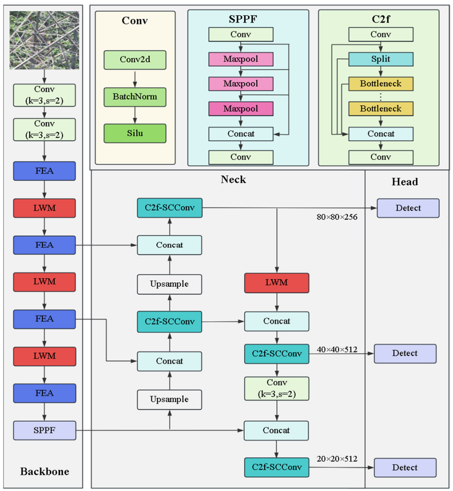

# RailDock Vision AI – Inference Baseline

철도 시설물 영상(MP4)을 입력으로 받아  
애자, 전차선, 클램프, 프로텍터, 행거 등의 **이상 객체를 자동 탐지**하는  
Vision AI 추론 베이스라인 프로젝트입니다.

YOLOv8 계열을 기반으로 하며,  
논문 *A Lightweight Transmission Line Foreign Object Detection Algorithm Incorporating Adaptive Weight Pooling*  
의 구조를 참고하여 **경량화 + 다중 스케일 탐지 성능**을 강화한 커스텀 모델을 사용합니다.

---
  
## 0. 사용법
### 0.1 추론서버 사용법

- uv sync
- uv run main.py
#### 요청 예시 (curl)
```bash
curl -X 'POST' \
  'http://localhost:8000/infer' \
  -H 'accept: application/json' \
  -H 'Content-Type: application/json' \
  -d '{
  "rail_mp4": "<File URL>",
  "insulator_mp4": "<File URL>",
  "nest_mp4": "<File URL>",
  "conf": 0.25,
  "iou": 0.7,
  "stride": 5
}'
```

### 0.2 파인튜닝 및 피드백(데이터 적재) 사용법

#### 0.2.1 개요
본 프로젝트는 **엔지니어 피드백 데이터(zip)** 를 서버로 업로드하면(`POST /feedback`) 프로젝트의 `data/` 디렉토리에 **누적 저장**됩니다.

누적된 `data/`를 기반으로 **파인튜닝을 트리거**할 수 있습니다. (`POST /finetune`)

파인튜닝은 **요청-응답과 분리된 백그라운드 프로세스**로 실행되며, 완료 시 Hugging Face에 업로드됩니다.

---

#### 0.2.2 사전 준비

```bash
uv sync
```

- `.env` 설정 필요 (Notion 참고)
  - 최소 설정: `HF_TOKEN=...`

#### 서버 실행 (추론/파인튜닝 API 동일 서버)
```bash
uv run main.py
# 또는
uv run uvicorn app.app:app --host 0.0.0.0 --port 8000
```

---

#### 0.2.3 피드백 데이터 업로드 (data/ 누적 적재)

#### 업로드 ZIP 형식 (필수)
업로드되는 zip 내부는 아래 구조를 **반드시 포함**해야 합니다.

```
data/
  rail/
    origin/   (*.jpg)
    json/     (*.json)
  insulator/
    origin/   (*.jpg)
    json/     (*.json)
  nest/
    origin/   (*.jpg)
    json/     (*.json)
```

- `origin`의 `.jpg`와 `json`의 `.json`은 **파일명(stem)이 1:1 매칭**되어야 합니다.
  - 예: `xxx_000001.jpg` ↔ `xxx_000001.json`

#### 업로드 요청 예시 (Windows PowerShell)
```powershell
curl.exe -X POST "http://127.0.0.1:8000/feedback?overwrite=false" \
  -F "zip_file=@data.zip"
```

- `overwrite=false` (기본): 동일 파일명이 이미 존재하면 **skipped 처리**
- `overwrite=true`: 동일 파일명이 있으면 **덮어쓰기**

#### 성공 응답 예시
```json
{
  "ok": true,
  "summary": {
    "rail": {"pairs": 5, "copied": 5, "skipped": 0},
    "insulator": {"pairs": 6, "copied": 6, "skipped": 0},
    "nest": {"pairs": 2, "copied": 2, "skipped": 0}
  },
  "overwrite": false
}
```

---

#### 0.2.4 파인튜닝 실행 (POST /finetune)

- `/finetune` 호출 시 `data/` 디렉토리에 **누적된 데이터 전체**를 기반으로 학습이 수행됩니다.
- 파인튜닝은 **백그라운드 실행**되므로 요청이 끊겨도 학습은 계속 진행됩니다.
- 학습 완료 시 Hugging Face repo로 가중치를 업로드합니다.

#### 요청 예시 (Windows PowerShell)
```powershell
$bodyObj = @{
  tasks = "rail,insulator,nest"
  epochs = 2
  batch  = 2
  imgsz  = 640
  device = "0"
  hf_repo_rail      = "stcheesecake-gh/rail-detector"
  hf_repo_insulator = "stcheesecake-gh/insulator-detector"
  hf_repo_nest      = "stcheesecake-gh/nest-detector"
  hf_base_rail      = "weights/best.pt"
  hf_base_insulator = "weights/best.pt"
  hf_base_nest      = "weights/best.pt"
}

Invoke-RestMethod -Method Post -Uri "http://127.0.0.1:8000/finetune" \
  -ContentType "application/json" \
  -Body ($bodyObj | ConvertTo-Json -Depth 5)
```

#### 성공 응답 예시
```json
{
  "job_id": "<JOB_ID>",
  "state": "running"
}
```

---

#### 0.2.5 파인튜닝 상태 및 로그 확인

#### 상태 확인
```powershell
Invoke-RestMethod "http://127.0.0.1:8000/finetune/<JOB_ID>"
```

#### 로그 확인
```powershell
Invoke-RestMethod "http://127.0.0.1:8000/finetune/<JOB_ID>/logs?tail=200"
```

#### 로컬 결과 저장 위치

파인튜닝 실행 시 아래 경로에 job별 결과가 생성됩니다.

```
runs_finetune/<JOB_ID>/
  train.log
  status.json
  meta.json
  error.txt        # 실패 시
```

---

## 1. 프로젝트 개요

### 1.1 목적

- 고속철도 / 일반철도 영상(MP4)을 입력으로 받아 이상 객체 자동 탐지
- 추론 결과를 zip 파일 형태(이미지 + JSON) 형태로 출력

### 1.2 출력 결과

- Bounding Box가 시각화된 이미지 (`.jpg`)
- 프레임 단위 구조화된 JSON 메타데이터
- 클래스, 신뢰도(confidence), 위치 좌표 포함
- 결과는 zip 파일 형태로 반환

---

## 2. 모델 구조 설명

### 2.1 전체 아키텍처 개요

본 모델은 YOLOv8 Backbone을 기반으로 하되,  
철도 설비 환경에 맞게 다음 모듈을 추가·변형하였습니다.

- **FEA (Feature Extraction Attention)**
- **LWM (Lightweight Weight Module)**
- **C2f-SCConv**
- **SPPF (Spatial Pyramid Pooling – Fast)**

다중 스케일 Detect Head  
(80×80 / 40×40 / 20×20)을 사용하여  
소형 객체(애자, 클립, 전차선 부착물 등)에 대한 탐지 성능을 강화했습니다.

### 2.2 네트워크 구조도



### 2.3 핵심 기여점

- Adaptive Weight Pooling 기반 경량화 구조
- Neck 단계에서 다중 해상도 Feature 간 정보 손실 최소화
- 소형 철도 설비 객체 탐지 성능 개선
- 기존 YOLO 계열 대비 연산량 감소 + 정확도 유지

본 프로젝트는 해당 논문의 구조를 참고하여  
YOLOv8 프레임워크 위에 커스텀 모듈 형태로 구현되었습니다.

---

## 3. 디렉토리 구조

```text
raildock_Vision_AI/
├── main.py                          # FastAPI 서버 엔트리포인트
├── app/                             # 애플리케이션 패키지
│   ├── __init__.py
│   ├── app.py                       # FastAPI 앱 인스턴스
│   ├── Controller.py                # API 엔드포인트 정의
│   ├── schemas/
│   │   └── InferenceSchema.py       # 요청/응답 스키마
│   └── service/
│       ├── InferenceService.py      # 추론 비즈니스 로직
│       ├── infer_insulator.py       # 애자(Insulator) 추론 로직
│       ├── infer_nest.py            # 둥지(Nest) 추론 로직
│       └── infer_rail.py            # 선로/전차선 추론 로직
├── model/                           # 모델 가중치 및 설정
│   ├── insulator/
│   │   └── Yolo-v8n-laf/
│   │       ├── best.pt              # 애자 모델 가중치
│   │       └── insulator_hs_ns.yaml # 애자 클래스 정의
│   ├── nest/
│   │   ├── best.pt                  # 둥지 모델 가중치
│   │   └── nest_hs_ns.yaml          # 둥지 클래스 정의
│   └── rail/
│       └── Yolo-v8n-laf/
│           ├── best.pt              # 선로 모델 가중치
│           └── rail_hs_ns.yaml      # 선로 클래스 정의
├── ultralytics_custom/              # 커스텀 YOLOv8 모듈
├── Dockerfile                       # 추론 서버 Docker 이미지 정의
├── pyproject.toml                   # 프로젝트 의존성 (uv)
├── requirements.api.txt             # API / Inference용 Python 패키지
├── uv.lock
└── README.md
```

---

## 4. 사용 방법

본 프로젝트는 다음 두 가지 방식으로 사용할 수 있습니다.

- Docker 기반 FastAPI 추론 서버 실행 (권장)
- uv를 이용한 로컬 실행

### 4.1 Docker 기반 추론 서버 실행 (권장)
#### Docker 이미지 빌드
```bash
docker build -t raildock-vision:0.4
```
#### Docker 컨테이너 실행 (GPU 사용)
```bash
docker run --rm --gpus all -p 8000:8000 raildock-vision:0.4
```

### 4.2 Local Build

> [!warning]
> [uv](https://github.com/astral-sh/uv)설치가 필요합니다.

```bash
uv sync
uv run main.py
```

- FastAPI 서버는 아래 주소에서 실행됩니다.
  - http://localhost:8000

#### 엔드포인트
```text
POST /infer
```
#### 요청 예시 (curl)
```bash
curl -X 'POST' \
  'http://localhost:8000/infer' \
  -H 'accept: application/json' \
  -H 'Content-Type: application/json' \
  -d '{
  "rail_mp4": "<File URL>",
  "insulator_mp4": "<File URL>",
  "nest_mp4": "<File URL>",
  "conf": 0.25,
  "iou": 0.7,
  "stride": 5
}'
```

> [!NOTE]
> 자세한 내용은 `/docs`의 Swagger 문서 참고

#### 입력
- MP4 영상 파일 (선로 / 애자 / 둥지)

#### 출력
- zip 파일
  - Bounding Box가 시각화된 이미지(JPG)
  - 프레임 단위 JSON 메타데이터

